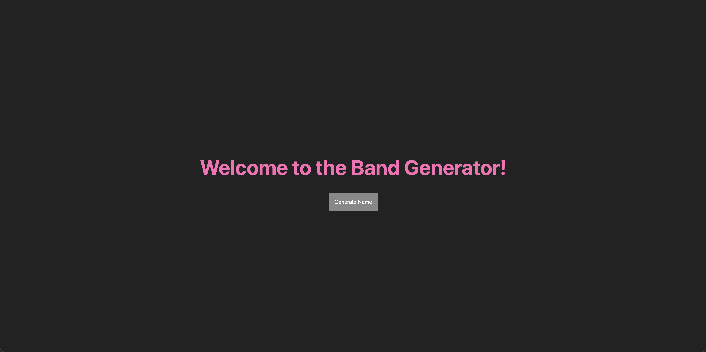

# Band Name Generator

[](#)
> A fun app that generates random band names with each click.

## Overview

The **Band Name Generator** is a simple web application built with EJS, Node.js, Express, and CSS. It allows users to generate random band names by clicking the "Generate Name" button, which combines random adjectives and nouns to create unique and interesting names.

## Preview

<p align="center">
  
</p>

## Features
- **Random Name Generation:** Generates a new band name with each click.
- **Dynamic UI with EJS:** Uses EJS templates for rendering dynamic content.
- **Express.js Backend:** Handles requests and serves the application.

## Live Demo

**Explore the live version here:** [View Live Demo](https://marius-bogdan.com/projects/band-name-generator/)

## Local Setup

1. **Clone** the repository:
   ```bash
   git clone https://github.com/MIBogdan/band-name-generator.git
   ```
2. **Navigate** to the project folder:
   ```bash
   cd band-name-generator
   ```
3. **Install** dependencies:
   ```bash
   npm install
   ```

4. **Run** the application:
   ```bash
   npm start
   ```
- The development server will open automatically in your default browser.
- **If it doesn't open automatically**,manually visit: http://localhost:3000 in your browser.

5. **Terminate** the server:
- **On macOS/Linux:** Press `Control + C` in the terminal. 
- **On Windows:** Press `Ctrl + C` in the Command Prompt or PowerShell. 
---

## Author

**Marius Bogdan**  
[Personal portfolio](https://marius-bogdan.com/)

Feel free to reach out for any questions or collaborations!

## License

This project is provided for testing and demonstration purposes only. All rights are reserved. No part of this project may be redistributed, reuploaded, or used in any manner (commercially or otherwise) without explicit written permission from the author.
